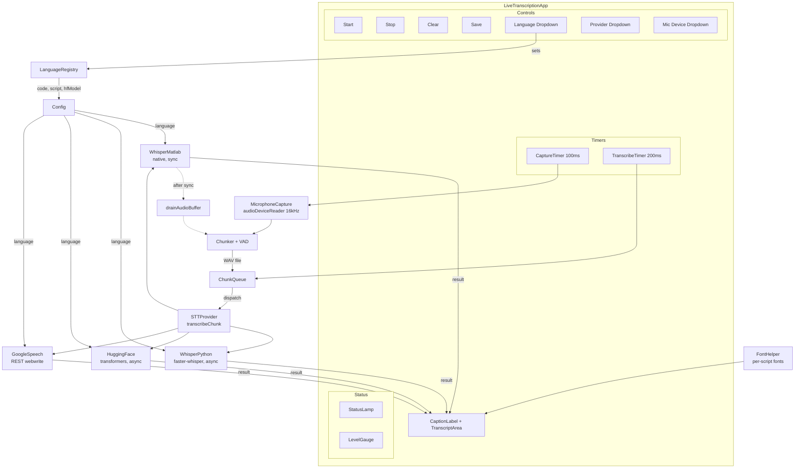

# Architecture

## Module Diagram



## Multi-Language Support

The language dropdown populates from `LanguageRegistry.displayNames()`. When the user selects a language:

1. `Config.Language`, `Config.LanguageCode`, and `Config.GoogleLanguageCode` are updated
2. `FontHelper.selectFont(script)` is called with the language's script to update caption/transcript fonts
3. The active provider is reloaded with the new language settings
4. For HuggingFace, a language-specific fine-tuned model is used if registered in `LanguageRegistry`

### LanguageRegistry

Static class that maps display names to:
- `code` — ISO 639-1 code (used by Whisper: `en`, `hy`, `es`, ...)
- `googleCode` — BCP-47 code (used by Google: `en-US`, `hy-AM`, ...)
- `script` — font script category (`latin`, `armenian`, `cyrillic`, `arabic`, `cjk`, `devanagari`, `greek`, `hebrew`)
- `hfModel` — optional HuggingFace model ID for language-specific fine-tuned models

20 languages supported: Arabic, Armenian, Chinese, Dutch, English, French, German, Greek, Hebrew, Hindi, Italian, Japanese, Korean, Persian, Polish, Portuguese, Russian, Spanish, Turkish, Ukrainian.

Fine-tuned HuggingFace models registered for: Armenian (`Chillarmo/whisper-small-hy-AM`), Hebrew (`ivrit-ai/whisper-v2-d3-e3`).

### FontHelper

Per-script font candidate lists with system probing:
- **Latin**: Segoe UI, Noto Sans, DejaVu Sans, Helvetica, Arial
- **Armenian**: Noto Sans Armenian, Noto Sans, DejaVu Sans, Sylfaen, Arial Unicode MS
- **Cyrillic**: Noto Sans, DejaVu Sans, Segoe UI, Arial Unicode MS
- **Arabic**: Noto Sans Arabic, Noto Sans, Segoe UI, Traditional Arabic
- **CJK**: Noto Sans CJK, Microsoft YaHei, MS Gothic, Malgun Gothic, SimHei
- **Devanagari**: Noto Sans Devanagari, Noto Sans, Mangal
- **Greek**: Noto Sans, DejaVu Sans, Segoe UI
- **Hebrew**: Noto Sans Hebrew, Noto Sans, David

## Runtime Flow

### 1. MicrophoneCapture

- Wraps `audioDeviceReader` configured at 16 kHz, mono, 1600 samples/frame.
- Runs in the CaptureTimer callback (100 ms period).
- Emits raw audio frames (1600×1 double arrays) to the Chunker.

### 2. Chunker / VAD

- Receives audio frames and computes per-frame RMS energy.
- VAD uses calibration-based noise floor with adaptive threshold.
- Detects speech onset (RMS above threshold for ≥ 3 frames) and speech offset (RMS below threshold for ≥ 10 frames).
- MinChunkDuration: 3.0 s, MaxChunkDuration: 8.0 s.
- On speech offset (or max duration reached), writes the accumulated speech segment to a temporary WAV file.
- Applies 0.5 s overlap with the next chunk to avoid splitting words at boundaries.
- Enqueues the WAV file path into the ChunkQueue for the TranscribeTimer to dispatch.

### 3. STTProvider (Abstract Interface)

All providers implement:

```matlab
classdef STTProvider < handle
    methods (Abstract)
        result = transcribeChunk(obj, wavPath, options)
        %   wavPath  — char, path to a 16 kHz mono WAV file
        %   options  — struct with optional fields
        %
        %   result   — struct with fields:
        %     .text      (string)  transcribed text
        %     .isFinal   (logical) true if final result
        %     .startTime (double)  chunk start time (s)
        %     .endTime   (double)  chunk end time (s)
        %     .raw       (struct)  provider-specific raw response
    end
end
```

Language is passed to providers via `Config.LanguageCode` (set at construction time).

#### WhisperMatlabProvider
- Uses `speechClient("whisper")` with `Language` mapped from ISO code to Whisper name
- Runs **synchronously** (not thread-safe)
- Includes hallucination filter

#### WhisperPythonProvider
- Calls `python/whisper_transcribe.py` with `--language` flag
- Runs async via `parfeval(backgroundPool, @system, ...)`

#### HuggingFaceProvider
- Calls `python/hf_transcribe.py` with `--language` and `--model` flags
- Model auto-selected from `LanguageRegistry` or `Config.HuggingFaceModel`
- Runs async via `parfeval(backgroundPool, @system, ...)`

#### GoogleSpeechProvider
- REST API via `webwrite` with `languageCode` from `Config.GoogleLanguageCode`

### 4. CaptionBuffer / Merger

- Maintains an ordered list of transcription results.
- Deduplicates overlapping chunks by comparing text similarity.
- Provides `clear()` and `getText()` methods.

### 5. LiveTranscriptionApp

- `uifigure`-based GUI created programmatically.
- **Language dropdown** (populated via `LanguageRegistry`) — updates Config, fonts, and provider on change.
- Dropdowns for mic device (populated via `audiodevinfo`) and STT provider.
- Dual-timer architecture:
  - **CaptureTimer** (100 ms): calls `MicrophoneCapture.readFrame()` → `Chunker.addFrame()` → enqueues WAV chunks.
  - **TranscribeTimer** (200 ms): dequeues a chunk from ChunkQueue → dispatches to the active STTProvider.
- WhisperMatlabProvider runs **synchronously**. After each synchronous transcription, `drainAudioBuffer()` recovers audio frames buffered during the blocking period.
- Python-based providers run async via `parfeval(backgroundPool, @system, ...)`.
- Status feedback: "Loading model...", "Listening...", "Hearing speech...", "Transcribing... Xs", "Queued: N chunks".

## Threading Model

```
Main MATLAB thread (runs both timer callbacks)
───────────────────────────────────────────────

CaptureTimer (100 ms)
  │
  ├── MicrophoneCapture.readFrame()
  ├── Chunker.addFrame()
  └── on chunk ready: enqueue WAV path → ChunkQueue

TranscribeTimer (200 ms)
  │
  ├── dequeue chunk from ChunkQueue
  ├── transcribeSynchronous()          [blocks 8–19 s for medium model]
  ├── drainAudioBuffer()               [recovers missed frames]
  └── update CaptionLabel + TranscriptArea


For Python providers (WhisperPython, HuggingFace):
  │
  └── parfeval(backgroundPool, @system, ...)   [non-blocking]
        └── on completion: update GUI via timer poll
```

**Key constraints:**

- `speechClient` / `speech2text` are **not thread-safe**. Must run synchronously on the main thread.
- During synchronous transcription (8–19 s), CaptureTimer callbacks are missed. `audioDeviceReader` continues buffering internally. `drainAudioBuffer()` recovers all buffered frames.
- Python-based providers call external processes via `system()`, which can safely run on `backgroundPool`.
- `backgroundPool` and `parfeval(backgroundPool, ...)` are base MATLAB (R2021b+) — no Parallel Computing Toolbox required.

## Toolbox Dependencies

| Toolbox | Required? | Used By |
|---------|-----------|---------|
| **Audio Toolbox** | Required | `audioDeviceReader`, `audiodevinfo`, `speechClient`, `speech2text` |
| **Deep Learning Toolbox** | Required for Whisper (MATLAB) | Model inference via `speechClient("whisper")` |
| **Audio Toolbox Interface for SpeechBrain and Torchaudio Libraries** | Required for Whisper (MATLAB) | Support package bridging `speechClient("whisper")` to PyTorch |
| **Signal Processing Toolbox** | Optional | `resample()` in offline demo only |
| **Parallel Computing Toolbox** | Optional | GPU acceleration (`ExecutionEnvironment="gpu"`) |

Python-based providers (WhisperPython, HuggingFace, Google) have no MATLAB toolbox dependencies beyond Audio Toolbox for `audioread`/`audiowrite`.
